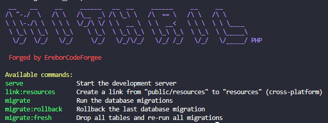

```
 __    __     __     ______   __  __     ______     __     __        
/\ "-./  \   /\ \   /\__  _\ /\ \_\ \   /\  == \   /\ \   /\ \       
\ \ \-./\ \  \ \ \  \/_/\ \/ \ \  __ \  \ \  __<   \ \ \  \ \ \____  
 \ \_\ \ \_\  \ \_\    \ \_\  \ \_\ \_\  \ \_\ \_\  \ \_\  \ \_____\ 
  \/_/  \/_/   \/_/     \/_/   \/_/\/_/   \/_/ /_/   \/_/   \/_____/ PHP
```


# MithrilPHP

**MithrilPHP** is a lightweight and resilient PHP engine designed to silently protect applications.  
Invisible by design, it provides a solid runtime foundation without imposing architectural decisions.

---

## Purpose

MithrilPHP exists to be the **engine behind frameworks**, not the framework itself.

It provides the essential building blocks required to execute applications reliably, while remaining lightweight, explicit, and opinion-free.

---

## Design Philosophy

Inspired by the Mithril worn by Frodo, MithrilPHP follows a simple principle:

> **You should not feel it — until it saves you.**

- The core protects execution, not business logic  
- The domain remains sovereign  
- The engine absorbs impact without dictating structure  

---

## What MithrilPHP Is

- A **core runtime engine**
- A foundation for frameworks
- A silent execution layer
- A console and HTTP backbone
- A **warm Worker** path for long-lived processes with a compiled container

---

## What MithrilPHP Is Not

- A full framework  
- A project skeleton  
- An MVC solution  
- A DDD or Clean Architecture implementation  

Those responsibilities belong to **frameworks built on top of MithrilPHP**.

---

## Core Responsibilities

- HTTP Kernel and routing execution  
- Console Kernel and command execution  
- Dependency Injection container (runtime + compiled)  
- Warm Worker loop (boot once, scoped per request)  
- Environment variable access  
- Configuration loading  
- Low-level abstractions required by frameworks  

---

## Warm Runtime / Worker

Classic PHP pays boot cost on every request. Mithril’s Worker boots **once**, keeps the compiled container warm, and isolates request state with `beginScope` / `endScope`.

| Lifetime | Use for |
|----------|---------|
| **preloaded / singleton** | Router, config, logger, connection pools |
| **scoped** | Request-bound state (tickets, UoW, auth context) |
| **factory** | Throwaway instances |

**Plug an existing Kernel** (methods you already have):

```php
use Erebor\Mithril\Contracts\HttpApplication;
use Erebor\Mithril\Runtime\FpmOnceBridge;
use Erebor\Mithril\Runtime\Worker;

final class Kernel implements HttpApplication
{
    // boot(), handle(Request): Response, getContainer() — already on your app Kernel
}

// public/index.php (FPM / php -S — one request, same Worker path)
$kernel = new Kernel();
(new Worker($kernel, new FpmOnceBridge()))->run();
```

**Multi-request in one process** (tests, custom bridges, future RoadRunner/FrankenPHP adapters):

```php
use Erebor\Mithril\Runtime\InMemoryBridge;
use Erebor\Mithril\Runtime\Worker;

$bridge = new InMemoryBridge([$requestA, $requestB]);
(new Worker($kernel, $bridge, maxRequests: 1000))->run();
```

- `FpmOnceBridge` — classic one-shot HTTP  
- `InMemoryBridge` — queue of requests for tests/benchmarks  
- `EregionBridge` — UDS + MessagePack for the Eregion Application Server (`forge serve`)  
- Implement `RequestBridge` for RoadRunner, FrankenPHP, or any transport  

`Container::loadCompiled(...)` stores a **warm baseline**; `resetWorker()` clears scoped/lazy instances and restores preloaded services without a full reboot.

Full guide: [docs/runtime-worker.md](docs/runtime-worker.md)

---

## Ecosystem

MithrilPHP is designed to power opinionated frameworks.

The first official implementation is:

- **Durin’s Forge** — a framework that forges real applications on top of MithrilPHP  

---

## Installation

```bash
composer require ereborcodeforge/mithrilphp
```

---



*Forged by EreborCodeForge*
